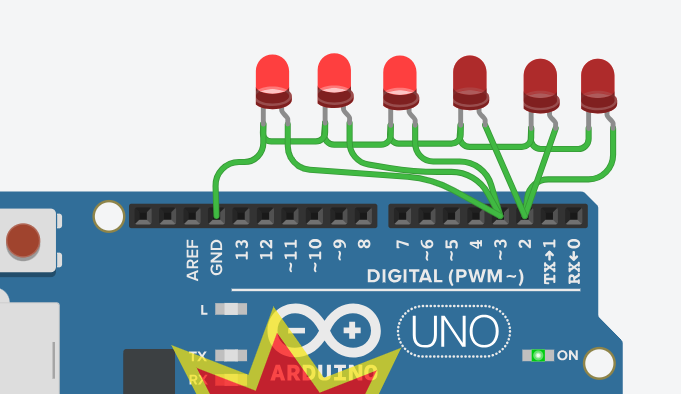

# Praktikum Mikrokontroler - Modul I: Percabangan dan Perulangan

**Nama:** Ibnu Abbas  
**NIM:** H1H024038  
**Mata Kuliah:** TK244005 - Praktikum Mikrokontroler  
**Program Studi:** Informatika, Universitas Jenderal Soedirman  

---

## 📌 Deskripsi Repositori
Repositori ini berisi *source code*, skematik rangkaian, dan dokumentasi hasil praktikum Modul I yang berfokus pada implementasi struktur kontrol percabangan (`if-else`) dan perulangan (`for`) menggunakan platform mikrokontroler Arduino. 

Praktikum ini dirancang untuk memahami bagaimana pengambilan keputusan logika dan perulangan memengaruhi jalannya eksekusi program perangkat keras, khususnya dalam memanipulasi pin *Output* untuk menyalakan susunan komponen LED.

---
## 🔬 Analisis Percobaan 1
### 1. Pada kondisi apa program masuk ke blok if? 
Pada kondisi nilai delay sudah kurang atau saama dengan seratus 
### 2. Pada kondisi apa program masuk ke blok else? 
Pada kondisi nilai delay diatas 100 yang mana ketika baru menyala nilainya adalah 1000
### 3.  Apa fungsi dari perintah delay(timeDelay)? 
Fungsi dari delay adalah mendefinisikan waktu yang akan dipakai untuk  menyalakan dan mematikan LED
### 4.  Berikan penjelasan disetiap baris kode nya setalah  LED tidak langsung reset → tetapi berubah dari cepat → sedang → mati
```cpp
const int ledPin = 6;        // Pin digital tempat LED terhubung
int timeDelay = 1000;        // Nilai awal delay (ms)

void setup() {
  pinMode(ledPin, OUTPUT);   // Atur pin LED sebagai output
}

void loop() {
  // Nyalakan LED
  digitalWrite(ledPin, HIGH);
  delay(timeDelay);

  // Matikan LED
  digitalWrite(ledPin, LOW);
  delay(timeDelay);

  // Ubah pola delay setelah 1 siklus kedip
  if (timeDelay <= 100) { 
    delay(3000);             // jeda 3 detik sebelum reset
    timeDelay = 1000;        // reset ke kondisi mati (awal)
  } 
  else if (timeDelay <= 500) {
    timeDelay = 700;         // dari cepat → sedang
  } 
  else {
    timeDelay -= 200;        // percepatan bertahap (1000 → 800 → 600 → dst)
  }
}
---
## Analisa Percobaan 2
### 1. Gambarkan rangkaian schematic 5 LED running yang digunakan pada percobaan!

### 2. Jelaskan bagaimana program membuat efek LED berjalan dari kiri ke kanan!
Ketika program menyalakan pin 7 maka program akan beralih ke loppingan for yang kedua dimana isinya dalah mengurangi pin output sehingga pin yang aktif adalah dari kiri ke kanan.
### 3.Jelaskan bagaimana program membuat LED kembali dari kanan ke kiri!
Porogram menjalankan looping for pertama yang mengaktifkan pin 2 hingga ke 8
### 4.Buatkan program agar LED menyala tiga LED kanan dan tiga LED kiri secara bergantian  dan berikan penjelasan disetiap baris kode nya dalam bentuk README.md!
```cpp
int timer = 100;           
// delay. Semakin tinggi angkanya, semakin lambat waktunya. 
void setup() { 
// gunakan loop for untuk menginisialisasi setiap pin sebagai 
output: 
for (int ledPin = 2; ledPin < 4; ledPin++) { 
pinMode(ledPin, OUTPUT); 
} 
} 
void loop() { 
// looping dari pin rendah ke tinggi 
for (int ledPin = 2; ledPin < 4; ledPin++) { 
// hidupkan LED pin nya: 
digitalWrite(ledPin, HIGH); 
delay(timer); 
// matikan pin LED nya: 
digitalWrite(ledPin, LOW); 
}
for (int ledPin = 3; ledPin >= 2; ledPin--) { 
// menghidupkan pin: 
digitalWrite(ledPin, HIGH); 
delay(timer); 
// mematikan pin: 
digitalWrite(ledPin, LOW); 
} 
}
Program tetap sama hanya saja wiringnya dijadikan 1 sehingga tetap bisa menghasilkan output yang sama berikut adalah Wiringnya



## 📁 Penjelasan File Program

### 1. `Praktikum_Percobaan_1.ino` (Percabangan)
**Tujuan Kode:** File ini berisi program untuk mendemonstrasikan fungsi struktur logika percabangan menggunakan instruksi `if-else`. Program ini bertujuan untuk mengevaluasi kondisi parameter batas waktu tunda (*delay*) dan secara dinamis mengubah kecepatan fase kedipan sebuah LED tunggal tanpa memerlukan intervensi manual dari pengguna. Pada tugas modifikasi praktikum ini, program dirancang agar siklus nyala LED berubah secara bertahap: mulai dari fase berkedip cepat, kemudian memelan (kecepatan sedang), dan pada akhirnya sistem akan menahan LED dalam kondisi mati secara permanen (*reset*).

### 2. `Modul_1_Percobaann_2.ino` (Perulangan)
**Tujuan Kode:** File ini berisi program untuk mendemonstrasikan efisiensi struktur kendali perulangan menggunakan instruksi `for` *loop*. Program ini bertujuan untuk memanipulasi rentetan banyak pin digital secara otomatis hanya dengan sedikit baris kode guna menciptakan efek visual pergerakan cahaya pada susunan enam buah LED. Pada tugas modifikasi praktikum ini, instruksi perulangan direkayasa untuk membagi deretan 6 LED menjadi dua blok terpisah (3 LED di sisi kiri dan 3 LED di sisi kanan), di mana program akan memerintahkan kedua kelompok tersebut untuk menyala secara bergantian secara terus-menerus.

---

## 📸 Dokumentasi Praktikum

Percobaan 1:([Lampiran percobaan 1 Praktikum](https://github.com/ibasKs81/Praktikum-Modul1/blob/main/WhatsApp%20Image%202026-04-07%20at%2013.12.22.jpeg))
Percobaan 2: ([Lampiran percobaan 2 Praktikum](https://github.com/ibasKs81/Praktikum-Modul1/blob/main/WhatsApp%20Image%202026-04-07%20at%2013.12.27.jpeg))

### 1. Skematik Rangkaian
!Skematik Rangkaian prcobaan 1([Tautan Gambar Skematik_1 Di Sini](https://github.com/ibasKs81/Praktikum-Modul1/blob/main/Screenshot%202026-04-08%20015201.png))
!Skematik Rangkaian prcobaan 2([Tautan Gambar Skematik_2 Di Sini](https://github.com/ibasKs81/Praktikum-Modul1/blob/main/Screenshot%202026-04-08%20015551.png))

*Laporan praktikum lengkap beserta analisis data tersedia pada direktori utama repositori ini dalam format dokumen.*
